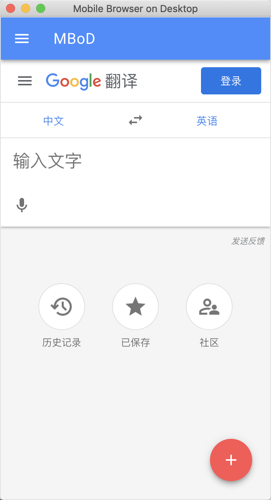

<p align="center">
   
</p>

<div align="center">
<h1>MBoD - Mobile Browser on Desktop</h1>


A minimalistic, fast and lightweight mobile browser on the desktop.
</div>

## Features
- MBoD current target macOS. 
- MBoD is built with Electron.  
- Browser
- Collectons
- Settings

## Screenshot


## Install

```sh
npm install
```

## Run tests

```sh
npm run test
```
